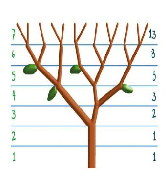

# Recursion

#### Find the nth Fibonacci number

**complete the code in `index.js`**

- Create a function named `fibonacci`
- The function should take a number as argument
- The function should return the sequence of fibonacci numbers based on the passed number
- The result should be returned as an array

- Note: The <a href="https://en.wikipedia.org/wiki/Fibonacci_number" target="_blank">Fibonacci Sequence</a> is the series of numbers: 0, 1, 1, 2, 3, 5, 8, 13, 21, 34, . . . Each subsequent number is the sum of the previous two.

- Hint :

  1. The first two numbers by default are always 0,1 if the argument bigger than 1 then the next number is the sum of this two numbers
  2. The functions argument is represent the last index of the array

- Real life example where we can find fibonacci in our life 
- Reference [fibonacci-in-nature](https://stemettes.org/zine/articles/fibonacci-in-nature/)

```javascript
fibonacci(0); // [0]
fibonacci(1); // [0, 1]
fibonacci(2); // [0, 1, 1]
fibonacci(5); // [0, 1, 1, 2, 3, 5]
fibonacci(8); // [0, 1, 1, 2, 3, 5, 8, 13, 21]
```