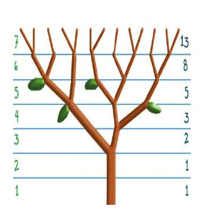

# Rekursion

#### Finde die n-te Fibonacci-Zahl

- Schreibe ein JavaScript-Programm, um die ersten n Fibonacci-Zahlen zu ermitteln.

**Vervollständigen Sie den Code in `index.js`**

- Erstelle einer Funktion mit dem Namen `fibonacci`
- Die Funktion sollte eine Zahl als Argument verwenden
- Die Funktion sollte die Sequenz der Fibonacci-Zahlen basierend auf der übergebenen Zahl zurückgeben
- Das Ergebnis sollte als Array zurückgegeben werden

- Hinweis: Die Fibonacci-Folge ist die Reihe der Zahlen: 0, 1, 1, 2, 3, 5, 8, 13, 21, 34, . . . Jede folgende Zahl ist die Summe der beiden vorherigen.

- Andeutung:

1. Die ersten beiden Zahlen sind standardmäßig immer 0,1, wenn das Argument größer als 1 ist, dann ist die nächste Zahl die Summe dieser beiden Zahlen
2. Das Functions Argument stellt den letzten Index des Arrays dar

- Beispiel aus dem wirklichen Leben, wo wir Fibonacci in unserem Leben finden können 
- Literatur [fibonacci-in-nature](https://stemettes.org/zine/articles/fibonacci-in-nature/)

```javascript
fibonacci(0); // [0]
fibonacci(1); // [0, 1]
fibonacci(2); // [0, 1, 1]
fibonacci(5); // [0, 1, 1, 2, 3, 5]
fibonacci(8); // [0, 1, 1, 2, 3, 5, 8, 13, 21]
```
